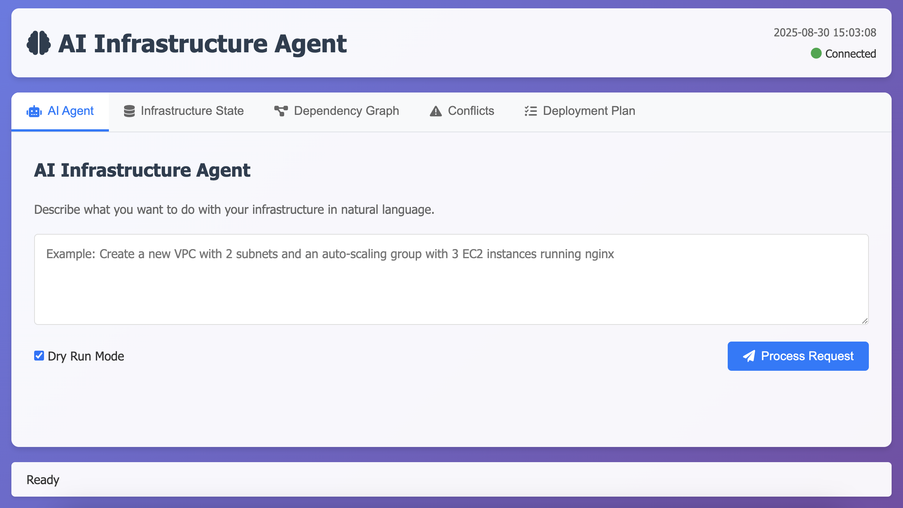
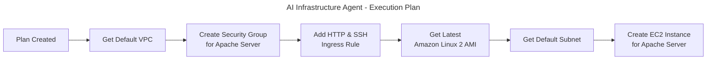

# AI Infrastructure Agent

> ⚠️ **Proof of Concept Project**: This repository contains a proof-of-concept implementation of an AI-powered infrastructure management agent. It is currently in active development and **not intended for production use**. We plan to release a production-ready version in the future. Use at your own risk and always test in development environments first.

<h1 align="center" style="border-bottom: none">
  
</h1>

<div align="center">

[](https://golang.org/)
[](https://aws.amazon.com/)
[](https://modelcontextprotocol.io/)

*Intelligent AWS infrastructure management through natural language interactions*

</div>

## What is AI Infrastructure Agent?

AI Infrastructure Agent is an intelligent system that allows you to manage AWS infrastructure using natural language commands. Powered by advanced AI models (OpenAI GPT, Google Gemini, or Anthropic Claude), it translates your infrastructure requests into executable AWS operations while maintaining safety through conflict detection and resolution.

### Key Features

- **Natural Language Interface** - Describe what you want, not how to build it
- **Multi-AI Provider Support** - Choose between OpenAI, Google Gemini, or Anthropic
- **Safety First** - Built-in conflict detection and dry-run mode
- **Web Dashboard** - Visual interface for infrastructure management
- **Smart Planning** - AI generates and explains execution plans before acting
- **Terraform-like state** - Maintains accurate infrastructure state

## Example Usage

<h1 align="center" style="border-bottom: none">
  
</h1>

Imagine you want to create AWS infrastructure with a simple request:

> **"Create an EC2 instance for hosting an Apache Server with a dedicated security group that allows inbound HTTP (port 80) and SSH (port 22) traffic."**

Here's what happens:

### 1. AI Analysis & Planning

The AI agent analyzes your request and creates a detailed execution plan:



The agent presents the plan for your review:
- Shows exactly what will be created
- Waits for your approval

### 2. Execution & Monitoring

Once approved, the agent:
- Creates resources in the correct order
- Monitors progress in real-time
- Handles dependencies automatically
- Reports completion status

## Prerequisites

- **Go 1.24.2+** - Programming language runtime
- **AWS Account** - With appropriate IAM permissions
- **AI Provider API Key** - Choose from: OpenAI API Key, Google Gemini API Key, Anthropic API Key

## Quick Installation

### Automated Installation (Recommended)

```bash
# Clone the repository
git clone https://github.com/VersusControl/ai-infrastructure-agent.git
cd ai-infrastructure-agent

# Run the installation script
./scripts/install.sh
```

The installation script will:
- ✅ Check and install Go 1.24.2+
- ✅ Setup AWS CLI (if needed)
- ✅ Create necessary directories
- ✅ Build both MCP server and Web UI
- ✅ Create configuration files
- ✅ Generate launcher scripts

### Manual Installation

<details>
<summary>Click to expand manual installation steps</summary>

```bash
# 1. Install Go 1.24.2+
# Visit: https://golang.org/dl/

# 2. Install AWS CLI
# Visit: https://aws.amazon.com/cli/

# 3. Clone and build
git clone https://github.com/VersusControl/ai-infrastructure-agent.git
cd ai-infrastructure-agent

# 4. Install dependencies
go mod download
go mod tidy

# 5. Build applications
go build -o bin/web-ui cmd/web/main.go

# 6. Create directories
mkdir -p bin logs backups tmp

# 7. Setup configuration
cp config.openai.yaml.example config.yaml
```

</details>

## Configuration

### 1. Edit Configuration File

```bash
# Edit the main configuration
nano config.yaml
```

### 2. Set Your AI Provider

Choose your preferred AI provider in `config.yaml`:

```yaml
agent:
  provider: "openai"          # Options: openai, gemini, anthropic
  model: "gpt-4"             # Model to use
  max_tokens: 4000
  temperature: 0.1
  dry_run: true              # Start with dry-run enabled
  auto_resolve_conflicts: false
```

### 3. Set Environment Variables

```bash
# For OpenAI
export OPENAI_API_KEY="your-openai-api-key"

# For Google Gemini
export GEMINI_API_KEY="your-gemini-api-key"

# For Anthropic
export ANTHROPIC_API_KEY="your-anthropic-api-key"
```

### 4. Configure AWS Credentials

```bash
# Configure AWS CLI
aws configure

# Or set environment variables
export AWS_ACCESS_KEY_ID="your-access-key"
export AWS_SECRET_ACCESS_KEY="your-secret-key"
export AWS_DEFAULT_REGION="us-west-2"
```

## Getting Started

Start the Web UI

```bash
./scripts/run-web-ui.sh
```

### Access the Dashboard

Open your browser and navigate to:
```
http://localhost:8080
```

## Usage Examples

### Basic Infrastructure Requests

```bash
# Simple EC2 instance
"Create a t3.micro EC2 instance with Ubuntu 22.04"

# Web server setup
"Deploy a load-balanced web application with 2 EC2 instances behind an ALB"

# Database setup
"Create an RDS MySQL database with read replicas in multiple AZs"

# Complete environment
"Set up a development environment with VPC, subnets, EC2, and RDS"
```

### Advanced Scenarios

```bash
# Multi-tier architecture
"Create a 3-tier web application with web servers, app servers, and database"

# Auto-scaling setup
"Deploy an auto-scaling group that scales based on CPU utilization"

# Secure environment
"Create a secure environment with private subnets and NAT gateway"

# Disaster recovery
"Set up a disaster recovery environment in a different region"
```

## Architecture

```
┌─────────────────┐    ┌─────────────────┐    ┌─────────────────┐
│   Web Interface │    │   MCP Server    │    │   AWS Services  │
│                 │    │                 │    │                 │
│  ┌─────────────┐│    │ ┌─────────────┐ │    │ ┌─────────────┐ │
│  │ Dashboard   ││◄──►│ │ Agent Core  │ │◄──►│ │ EC2         │ │
│  │ Forms       ││    │ │ AI Provider │ │    │ │ RDS         │ │
│  │ Monitoring  ││    │ │ AWS Client  │ │    │ │ VPC         │ │
│  └─────────────┘│    │ │ State Mgmt  │ │    │ │ ALB         │ │
└─────────────────┘    │ └─────────────┘ │    │ │ Auto Scaling│ │
                       └─────────────────┘    │ └─────────────┘ │
                                              └─────────────────┘
```

### Components

- **Web Interface**: React-based dashboard for visual interaction
- **MCP Server**: Core agent implementing Model Context Protocol
- **Agent Core**: AI-powered decision making and planning
- **AWS Client**: Secure AWS SDK integration
- **State Management**: Infrastructure state tracking and conflict resolution

## Safety Features

### Dry Run Mode
All operations can be run in "dry-run" mode first:
- Shows exactly what would be created/modified/deleted
- Estimates costs before execution
- No actual AWS resources are touched

### State Management
- Maintains accurate infrastructure state
- Detects drift from expected configuration

### Contributing

1. Fork the repository
2. Create a feature branch: `git checkout -b feature-name`
3. Make your changes
3. Run tests
4. Commit: `git commit -m "Add feature"`
5. Push: `git push origin feature-name`
6. Create a Pull Request

## Documentation

### Command Reference
- [MCP Server Commands](docs/mcp-commands.md) *(coming soon)*
- [Web API Reference](docs/api-reference.md) *(coming soon)*
- [Configuration Guide](docs/configuration.md) *(coming soon)*

### Tutorials
- [Getting Started Tutorial](https://medium.com/@hmquan08011996/ai-infrastructure-agent-for-cloud-7580bbd73cca)

## Troubleshooting

### Common Issues

<details>
<summary><strong>AWS Authentication Issues</strong></summary>

```bash
# Check AWS credentials
aws sts get-caller-identity

# Verify permissions
aws iam get-user

# Test basic AWS access
aws ec2 describe-regions
```

</details>

<details>
<summary><strong>AI Provider API Issues</strong></summary>

```bash
# Check API key is set
echo $OPENAI_API_KEY

# Test API connection
curl -H "Authorization: Bearer $OPENAI_API_KEY" \
     https://api.openai.com/v1/models
```

</details>

<details>
<summary><strong>Port Already in Use</strong></summary>

```bash
# Check what's using the port
lsof -i :8080
lsof -i :3000

# Kill processes if needed
kill -9 <pid>

# Or change ports in config.yaml
```

</details>

<details>
<summary><strong>Go Build Issues</strong></summary>

```bash
# Clean module cache
go clean -modcache

# Re-download dependencies
go mod download
go mod tidy

# Rebuild
go build ./...
```

</details>

<details>
<summary><strong>Decision validation failed: decision confidence too low: 0.000000</strong></summary>

Try increase max_tokens:

```yaml
agent:
  provider: "gemini"              # Use Google AI (Gemini)
  model: "gemini-2.5-flash-lite"
  max_tokens: 10000 # <-- increase
```

</details>

## Security Considerations

- **API Keys**: Never commit API keys to version control
- **AWS Permissions**: Use least-privilege IAM policies
- **Network Security**: Run in private networks when possible
- **Audit Logging**: Enable comprehensive logging for compliance
- **Dry Run**: Always test in dry-run mode first

## Roadmap

### Current Version (v0.1.0 - PoC)
- ✅ Basic natural language processing
- ✅ Core AWS resource management
- ✅ Web dashboard
- ✅ MCP protocol support

### Upcoming Features (v0.2.0)
- 🔄 Enhanced conflict resolution
- 🔄 Cost optimization recommendations
- 🔄 Infrastructure templates
- 🔄 Multi States
- 🔄 Role-based access control

## 🤝 Community & Support

- **GitHub Issues**: [Report bugs and request features](https://github.com/VersusControl/ai-infrastructure-agent/issues)
- **Discussions**: [Community discussions](https://github.com/VersusControl/ai-infrastructure-agent/discussions)

## 📄 License

This project is licensed under the MIT License - see the [LICENSE](LICENSE) file for details.

## ⚖️ Disclaimer

This is a proof-of-concept project. While we've implemented safety measures like dry-run mode and conflict detection, always:

- Test in development environments first
- Review all generated plans before execution
- Maintain proper AWS IAM permissions
- Monitor costs and resource usage
- Keep backups of critical infrastructure

The authors are not responsible for any costs, data loss, or security issues that may arise from using this software.

---

<div align="center">

**Built with ❤️ by the DevOps VN Team**

*Empowering infrastructure management through AI*

[⭐ Star this repo](https://github.com/VersusControl/ai-infrastructure-agent) | [🐛 Report Bug](https://github.com/VersusControl/ai-infrastructure-agent/issues) | [💡 Request Feature](https://github.com/VersusControl/ai-infrastructure-agent/issues)

</div>
