# Technical Architecture Overview

The AI Infrastructure Agent is a sophisticated infrastructure-as-code system that combines Large Language Model (LLM) capabilities with AWS resource management through the Model Context Protocol (MCP). It provides both programmatic and web interfaces for managing cloud infrastructure using natural language requests while maintaining safety through comprehensive conflict detection, state management, and execution planning.

The system is architected as a multi-layered application written in Go, supporting multiple AI providers (OpenAI GPT, Google Gemini, Anthropic Claude) and implementing enterprise-grade features including dry-run execution, real-time monitoring, dependency resolution, and conflict detection.

## High-Level System Architecture

### Core Components

<h1 align="center" style="border-bottom: none">
  
</h1>

### System Flow Architecture

The system follows a sophisticated request-response pattern with multiple validation and safety checkpoints:

1. **Input Processing**: Natural language requests received via web UI or API
2. **Context Analysis**: Current infrastructure state analysis using resource correlators
3. **AI Planning**: LLM-generated execution plans with dependency resolution
4. **Validation**: Multi-layer validation including conflict detection and safety checks
5. **Execution**: Controlled execution through MCP tools with real-time monitoring
6. **State Management**: Infrastructure state updates and drift detection

## Layer-by-Layer Technical Deep Dive

### 1. Web Layer

**Technology Stack**: Go HTTP server with WebSocket support
**Purpose**: Provides HTTP/WebSocket interface for user interactions

**Key Components:**
- **WebServer**: Main HTTP server with routing and middleware
- **REST Endpoints**: Comprehensive API for infrastructure operations
- **WebSocket Handler**: Real-time updates and progress monitoring
- **Template Engine**: Server-side rendering for web UI

**API Surface:**
```
GET  /                              # Web UI dashboard
GET  /api/state                     # Infrastructure state retrieval
POST /api/discover                  # Resource discovery
POST /api/plan                      # Execution plan generation
POST /api/agent/process             # Natural language processing
POST /api/agent/execute             # Plan execution
GET  /ws                           # WebSocket connection
```

**Technical Features:**
- RESTful API design with proper HTTP status codes
- WebSocket-based real-time updates during execution
- CORS support for development
- Request/response logging and error handling

### 2. Agent Layer

**Purpose**: AI-powered infrastructure decision making and orchestration

The Agent Layer is the core intelligence component, consisting of several specialized subsystems:

#### StateAware Agent
- **Multi-AI Provider Support**: Configurable integration with OpenAI, Google Gemini, and Anthropic
- **MCP Process Management**: Manages communication with MCP server processes
- **Resource Analysis Integration**: Incorporates pattern matching, field resolution, and value type inference
- **Thread-Safe Operations**: Concurrent access protection for resource mappings and capabilities

#### Request Processing
- **Context-Aware Analysis**: Processes natural language requests with current infrastructure context
- **Decision Context Generation**: Gathers comprehensive state information for AI decision making
- **Plan Generation**: Creates detailed execution plans with resource dependencies
- **Safety Validation**: Pre-execution validation for consistency and conflict detection

#### Plan Execution
- **Step-by-Step Execution**: Manages ordered execution of plan steps
- **Dependency Ordering**: Ensures resources are created in correct dependency order
- **Progress Tracking**: Real-time execution progress with detailed status updates
- **Error Handling**: Comprehensive error recovery and rollback capabilities
- **Dry-Run Support**: Full simulation mode without actual resource creation

#### Resource Analysis System
- **Pattern Matcher**: Advanced pattern matching for resource type identification
- **Field Resolver**: Intelligent field mapping between AWS APIs and internal structures
- **Value Type Inferrer**: Automatic type inference for plan generation
- **ID Extractor**: Resource ID extraction from complex data structures

#### Retrieval System
- **Global Registry**: Thread-safe registry for dynamic retrieval function registration
- **Pattern-Based Matching**: Flexible retrieval function matching using regex patterns
- **Context-Aware Execution**: Integration with MCP responses and plan execution context

**Core Data Structures:**
```go
type StateAwareAgent struct {
    // AI Integration
    llm               llms.Model
    config            *config.AgentConfig
    
    // MCP Communication
    mcpProcess        *MCPProcess
    resourceMappings  map[string]string
    mcpTools          map[string]MCPToolInfo
    
    // Resource Analysis
    patternMatcher    *resources.PatternMatcher
    fieldResolver     *resources.FieldResolver
    valueTypeInferrer *resources.ValueTypeInferrer
    
    // Concurrency Control
    mappingsMutex     sync.RWMutex
    capabilityMutex   sync.RWMutex
}
```

### 3. MCP Layer

**Purpose**: Model Context Protocol implementation for AI-tool communication

The MCP layer implements the Model Context Protocol specification, providing a standardized interface between AI models and infrastructure tools.

#### MCP Server
- **Protocol Implementation**: Full MCP specification compliance
- **Tool Registration**: Dynamic tool registration and capability discovery
- **Resource Management**: Resource schema definition and validation
- **Request Routing**: Intelligent routing of tool calls to appropriate handlers

#### Tool Manager
- **Tool Factory Pattern**: Dynamic tool creation and lifecycle management
- **Capability Discovery**: Runtime tool capability enumeration
- **Execution Routing**: Request routing to appropriate tool implementations
- **Error Handling**: Standardized error responses and recovery

#### Resource Management
- **Resource Registry**: Centralized resource definition management
- **Schema Definitions**: Resource schema and validation rules
- **Integration Layer**: Integration with other system components

### 4. Tools Layer

**Purpose**: Comprehensive AWS infrastructure operation tools

The Tools layer provides 50+ specialized tools organized by AWS service category:

**Tool Categories:**
- **EC2 Tools**: Instance lifecycle, AMI management, key pair operations
- **VPC Tools**: Network infrastructure (VPCs, subnets, gateways, routing)
- **Security Group Tools**: Firewall rule management and validation
- **Load Balancer Tools**: ALB operations, target groups, listeners, health checks
- **Auto Scaling Tools**: ASG management, launch templates, scaling policies
- **RDS Tools**: Database operations, snapshots, parameter groups
- **State Tools**: Infrastructure analysis, export, visualization
- **Discovery Tools**: Resource discovery and correlation

**Tool Architecture:**
```go
type MCPTool interface {
    Execute(ctx context.Context, args map[string]interface{}) (*mcp.CallToolResult, error)
    GetSchema() map[string]interface{}
    GetMetadata() ToolMetadata
}

type ToolDependencies struct {
    AWSClient        *aws.Client
    StateManager     interfaces.StateManager
    DiscoveryScanner *discovery.Scanner
    GraphManager     *graph.Manager
    ConflictResolver *conflict.Resolver
}
```

**Key Features:**
- Standardized tool interface for consistency
- Comprehensive input validation and schema definition
- Detailed metadata for AI model understanding
- Integration with state management and conflict resolution

### 5. Adapters Layer

**Purpose**: Service-specific adapters providing standardized AWS resource interfaces

The Adapters layer implements the Adapter pattern to provide consistent interfaces across different AWS services:

#### Base Adapter
- **Common Functionality**: Shared resource lifecycle management
- **Error Handling**: Standardized error responses and logging
- **Resource Metadata**: Consistent metadata extraction and handling
- **Validation Framework**: Common validation patterns

#### Service-Specific Adapters
- **VPC Adapter**: Networking resource management
- **EC2 Adapter**: Compute instance operations
- **ALB Adapter**: Load balancer management
- **ASG Adapter**: Auto scaling operations
- **RDS Adapter**: Database resource management
- **Security Group Adapter**: Security rule management

**Standardized Interface:**
```go
type AWSResourceAdapter interface {
    GetResourceType() string
    ValidateResource(resource *types.ResourceState) error
    NormalizeResource(rawResource interface{}) (*types.ResourceState, error)
    ExtractMetadata(resource interface{}) map[string]interface{}
}
```

### 6. AWS Integration Layer

**Purpose**: AWS SDK abstraction and client management

**Key Components:**
- **Multi-Service Client**: Centralized AWS SDK integration
- **Service Implementations**: Dedicated clients for EC2, VPC, ALB, ASG, RDS, Security Groups
- **Error Handling**: AWS-specific error handling and retry logic
- **Authentication**: IAM role and credential management
- **Regional Support**: Multi-region operation capabilities

**Features:**
- Connection pooling and resource management
- Automatic retry with exponential backoff
- Comprehensive logging and metrics
- Health checking and connectivity validation

### 7. State Management

**Purpose**: Infrastructure state persistence and change tracking

The State Management layer provides sophisticated state tracking capabilities:

**Core Features:**
- **State Persistence**: JSON-based state storage with versioning
- **Change Detection**: Automatic drift detection and reporting
- **Dependency Tracking**: Resource dependency graph management
- **Conflict Detection**: Multi-resource conflict identification
- **Rollback Support**: State rollback and recovery capabilities

**State Structure:**
```go
type InfrastructureState struct {
    Version      string                    `json:"version"`
    LastUpdated  time.Time                 `json:"lastUpdated"`
    Region       string                    `json:"region"`
    Resources    map[string]*ResourceState `json:"resources"`
    Dependencies map[string][]string       `json:"dependencies"`
    Metadata     map[string]interface{}    `json:"metadata"`
}
```

### 8. Configuration System

**Purpose**: Centralized configuration management and pattern definitions

**Configuration Architecture:**
- **Main Configuration** (`config.yaml`): System-wide settings
- **Resource Patterns** (`settings/resource-patterns.yaml`): AWS resource ID patterns
- **Field Mappings** (`settings/field-mappings.yaml`): API response field mappings
- **Extraction Rules** (`settings/resource-extraction.yaml`): Value extraction patterns

**Key Features:**
- YAML-based configuration with environment variable override support
- Hot-reload capabilities for development
- Validation and schema enforcement
- Environment-specific configuration profiles

## Advanced Technical Features

### 1. Resource Analysis System

The Resource Analysis System provides intelligent resource handling through multiple specialized components:

#### Pattern Matching Engine
- **Regex-Based Detection**: Advanced AWS resource type detection using compiled regex patterns
- **Performance Optimization**: Pattern compilation and caching for high-performance matching
- **Tool Mapping**: Automatic mapping between tool names and resource types
- **Extensible Patterns**: Configuration-driven pattern definitions

#### Field Resolution Engine
- **Dynamic Mapping**: Runtime field mapping between AWS API responses and internal structures
- **Nested Field Support**: Deep object traversal with dot notation support
- **Type Conversion**: Automatic type conversion and validation
- **Error Recovery**: Graceful handling of missing or malformed fields

#### Value Type Inference
- **Context-Aware Inference**: Intelligent type inference based on field names and descriptions
- **Pattern-Based Rules**: Configurable inference rules with pattern matching
- **Integration Support**: Deep integration with resource patterns and field mappings

### 2. Conflict Resolution System (Not Ready)

**Advanced Conflict Detection:**
- **Resource Naming**: Automatic detection of naming conflicts
- **Dependency Analysis**: Complex dependency conflict identification
- **State Consistency**: Multi-resource consistency validation
- **Resolution Strategies**: Automated conflict resolution with user confirmation

### 3. Graph Analysis System (Not Ready)

**Dependency Management:**
- **Graph Construction**: Dynamic resource dependency graph building
- **Topological Sorting**: Optimal deployment order calculation
- **Circular Detection**: Automatic detection of circular dependencies
- **Impact Analysis**: Change impact analysis for infrastructure modifications

### 4. Discovery System

**Infrastructure Discovery:**
- **Multi-Service Scanning**: Comprehensive AWS resource discovery
- **State Correlation**: Automatic correlation with managed state (Not Ready)
- **Drift Detection**: Identification of configuration drift (Not Ready)
- **Relationship Mapping**: Resource relationship discovery and mapping

## Testing Architecture

### Comprehensive Mock System

The testing architecture includes a sophisticated mock system that provides realistic testing environments:

**Mock Components:**
- **MockMCPServer**: Complete MCP server simulation with all 50+ tools
- **MockStateManager**: State management simulation with real resource analysis
- **MockAWSClient**: Comprehensive AWS API simulation with realistic responses
- **MockAdapters**: Service-specific adapter mocks for isolated testing

**Real Component Integration:**
- **Actual Pattern Matching**: Uses production pattern matching logic
- **Real Field Resolution**: Production field resolution with configuration integration
- **Production Value Inference**: Real value type inference with pattern-based logic
- **Settings Integration**: Full integration with actual configuration files

## Security Architecture

### Security Layers

1. **API Security**: Request validation, rate limiting, CORS configuration
2. **Authentication**: AWS IAM integration with least-privilege principles
3. **Data Protection**: Secure state file storage with proper permissions
4. **Network Security**: WebSocket origin validation and secure communication
5. **Audit Trail**: Comprehensive logging and audit trail generation

### Security Best Practices

- Environment variable-based API key management
- IAM role-based AWS access with minimal permissions
- Input sanitization and validation at all layers
- Secure state file storage with restricted access
- Comprehensive audit logging for compliance requirements

## Conclusion

The AI Infrastructure Agent represents a sophisticated approach to infrastructure automation, combining the power of Large Language Models with robust engineering practices. The system's layered architecture provides separation of concerns while maintaining flexibility and extensibility.

Key architectural strengths include:

- **Modularity**: Clear separation of concerns with well-defined interfaces
- **Safety**: Multiple validation layers and dry-run capabilities
- **Extensibility**: Plugin-based architecture for tools and adapters
- **Reliability**: Comprehensive error handling and recovery mechanisms
- **Performance**: Optimized for concurrent operations and resource efficiency
- **Security**: Multiple security layers with defense-in-depth approach

The system is designed to scale from proof-of-concept deployments to production environments while maintaining the simplicity of natural language infrastructure management.
