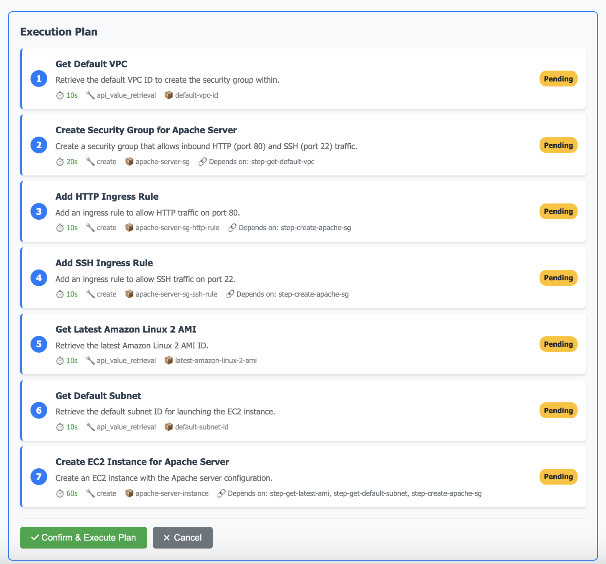
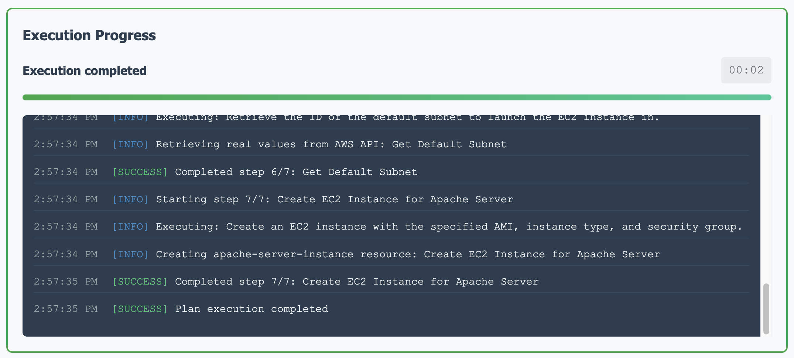
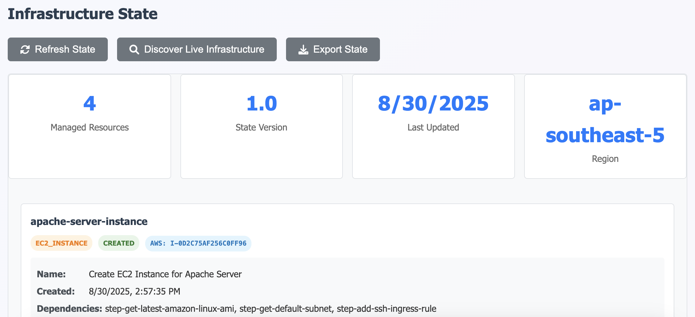

# Getting Started

This guide will help you quickly install and start using the AI Infrastructure Agent to create AWS infrastructure using natural language commands.

## Prerequisites Checklist

Before diving in, make sure you have:

- ✅ **AWS Account** with appropriate IAM permissions
- ✅ **Go 1.19+** installed on your system
- ✅ **AI Provider API Key** (OpenAI, Gemini, or AWS Bedrock Nova)
- ✅ **Basic understanding** of AWS services (EC2, VPC, Security Groups)

## Step 1: Installation & Setup

### Quick Installation

```bash
# Clone the repository
git clone https://github.com/VersusControl/ai-infrastructure-agent.git
cd ai-infrastructure-agent

# Run the automated installation script
./scripts/install.sh
```

The installation script will handle everything for you:
- Install Go dependencies
- Build the applications
- Create necessary directories
- Set up configuration files

### Configure Your Environment

1. **Set up your AI provider API key:**

Choose one of the following providers and set up your API access:

**Option A: OpenAI (Recommended)**
```bash
# Copy and edit configuration
cp config.openai.yaml.example config.yaml
# Edit config.yaml with your OpenAI API key
```

**Option B: Google Gemini**
```bash
# Copy and edit configuration
cp config.gemini.yaml.example config.yaml
# Edit config.yaml with your Gemini API key
```

**Option C: AWS Bedrock Nova**
```bash
# Copy and edit configuration
cp config.bedrock.yaml.example config.yaml
# Configure AWS credentials for Bedrock access
```

> 📖 **Need help with API setup?** Check our detailed guides:
> - [OpenAI API Setup](/api-key-setup/openai-api-setup.md)
> - [Google Gemini API Setup](/api-key-setup/gemini-api-setup.md) 
> - [AWS Bedrock Nova Setup](/api-key-setup/aws-bedrock-nova-setup.md)

2. **Configure AWS credentials:**

```bash
# Method 1: Using AWS CLI (recommended)
aws configure

# Method 2: Environment variables
export AWS_ACCESS_KEY_ID="your-access-key"
export AWS_SECRET_ACCESS_KEY="your-secret-key"
export AWS_DEFAULT_REGION="us-west-2"
```

3. **Start the Web UI:**

```bash
./scripts/run-web-ui.sh
```

Open your browser and navigate to:

```
http://localhost:8080
```


The dashboard provides:
- **Natural language input** for infrastructure requests
- **Visual execution plans** before any changes
- **Real-time monitoring** of infrastructure operations
- **State management**

---

## Step 2: Your First Infrastructure Request

Let's create a simple web server infrastructure with a practical example. In the web dashboard, enter this natural language request:

> **"Create an EC2 instance for hosting an Apache Server with a dedicated security group that allows inbound HTTP (port 80) and SSH (port 22) traffic."**

### What Happens Next

#### 1. AI Analysis & Planning



The AI agent will:
- Parse your natural language request
- Identify required AWS resources
- Generate a detailed execution plan
- Show dependencies between resources

**Review the plan carefully** and click **"Approve & Execute"** when ready.

#### 2. Execution & Monitoring



Watch as the agent:
- Executes steps in the correct order
- Handles dependencies automatically
- Provides real-time progress updates
- Reports any issues immediately

#### 3. Infrastructure State Tracking



## Next Steps

Now that you're up and running:

1. **Experiment** with different types of infrastructure requests
2. **Learn about the Architecture** - Check our [Architecture Overview](/architecture/architecture-overview.md)
4. **Contribute** improvements and bug fixes
5. **Share** your successful patterns with others

## Need Help?

- **GitHub Issues**: [Report bugs or request features](https://github.com/VersusControl/ai-infrastructure-agent/issues)
- **Discussions**: [Ask questions and share experiences](https://github.com/VersusControl/ai-infrastructure-agent/discussions)
